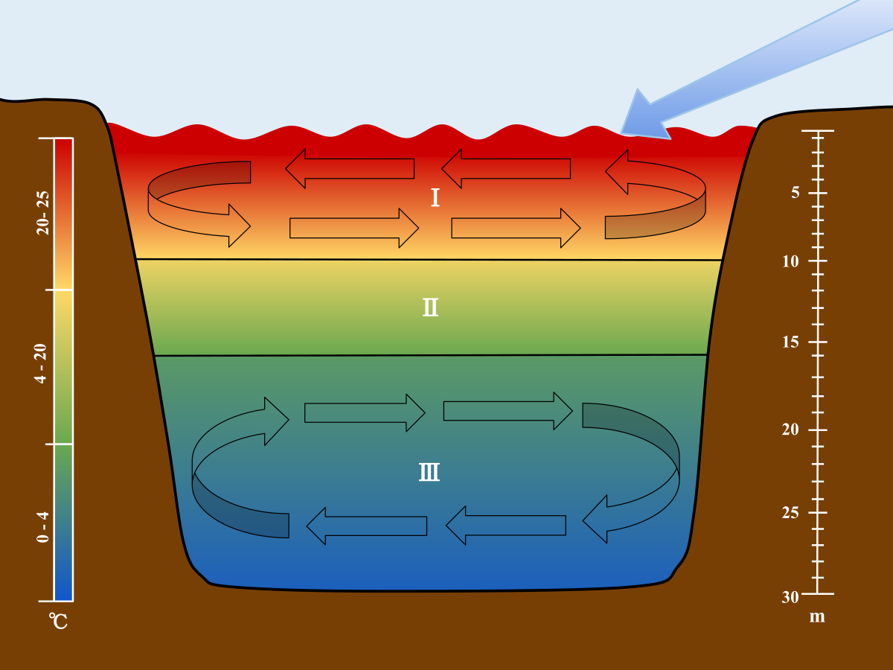

## LEAP Education 
#### Spring 2022
### Climate Predication Challenges 
### Project 2: Evaluating Physics-Guided Machine Learning Algorithms 
### -- for Modeling Lake Stratification



In this project, we will carry out **model extension and evaluation** for the predictive modeling of dynamic one-dimensional thermal stratification profiles in a lake. As climate data scientists, we often need to first **reproduce** a published method/model and then propose new improvements or extensions. This process requires the evaluation and comparison of different modeling/analysis strategies and deciding what is *working*. Such decisions need to be supported by sound evidence in the form of *model assessment, validation, and comparison*. In addition, we also need to **communicate our decision and supporting evidence** clearly and convincingly in an accessible fashion.

#### Challenge
For this project, you will download the Lake Mendota temperature data studied by ([Read *et al*, 2019](https://agupubs.onlinelibrary.wiley.com/doi/full/10.1029/2019WR024922)). We are interested in understanding the utility of all the moving parts of the proposed *process guided deep learning* algorithms in the paper and evaluate possible *improvements* for predicting lake water temperatures.

The computatability of such ML algorithms is an important factor in research. For computationally more expensive algoriths, we would like to see a notable improvement in performance. 

Here are some [starter codes](https://github.com/leap-stc/LEAPCourse-Climate-Pred-Challenges/blob/main/Project-StarterCodes/Project2-PhysicsML/lib/Lake_PyTorch.ipynb) for this project.

#### Evaluation criteria 
- Ease of reproducibility by the instruction team
	* are the codes for the proposed evaluations well annotated and documented?
	* can the analysis be re-run nearly automatically using the project's notebook.
- Level of reproducibility
	* Can we derive the same evaluation conclusion as presented in the team's final presentation using another randomized data partition and an independent running?
	* How close are the reported performances (presentation) to the reproduced performances?
- Scalability of the proposed final strategy
	* Size of the fully trained model
	* Computational speed for prediction.
	* Memory use for model training and prediction.
- Presentation and organization
	* Is the presentation convincing about the proposed evaluation?
	* Is it supported by adequate and appropriate evidence?
	* Is the notebook organized and prepared in a way that makes it easier for readers to understand the proposed evaluation and its conclusions?

*(More details will be posted as grading rubrics in courseoworks/canvas)*

#### Project details
For this challenge, you could evaluate any parts or their combinations of the algorithm or propose an extension to the algorithms used in the paper with validated performance gains. You would **recommend** a final model, which could be an optimal specification for the published model and an extended model with detailed specifications.

##### Project time table.
- Week 1 (Feb 8, 2022) introduction and project description
- Week 2 (Feb 15, 2022) a deep dive into the published model
- Weeks 3 + 4 (Feb 22 - Mar 1, 2022) design evaluation study
- Week 5 (Mar 8, 2022) Final presentations

##### Submission and Final presentation
Team should submit the link to the project's Google drive folder as submission (see below for suggested folder setup). 

For presentation, the team should present their **model recommendation** and support this recommendation with evidence on 

- Metrics used to measure performance
- Performance comparison with a set of other specifications;
- Computational complexity;
- Supporting evidence on why the proposed metric(s), evaluation and recommendation are sound.

The presentation can be technical but need to be accessible to your peer students in our class. 

##### Project learning support 

We will provide the following tutorials. 

+ week 2 (Feb 15, 2022) the physics behind thermal stratefication. 
+ week 2 (Feb 15, 2022) deep learning, LSTM and PGDL
+ week 3 (Feb 22, 2022) model evaluation

We will also have live discussion and brainstorm sessions each week.  

##### Platform requirement

The instructional team will evaluate your report using Google Colab with a [pro subscription](https://colab.research.google.com/signup). The pro subscription costs ~$10/month. The starter codes run without a pro subscription. Teams are encouraged to evaluate their own computational needs, and may consider or not the pro subscription as an option to consider more ambitious modeling choices. We will reimburse the cost of the pro subscription. 

##### Suggested team workflow
1. [wk1] Week 1 is the **learning** week. Read the paper, the starter codes, the data description, fully understand the **project requirement**, and discuss as team to understand the proposed models and algorithms. 
2. [wk1] As a team, study the starter codes, discuss how to collaborate using Google colab, and try a *subset* of data to get a sense of computational burden of this project. 
3. [wk2] Week 2 is the **exploration** week. Based on the in-class tutorials, start develop project ideas (start early on this one!) It is ok to have 2-3 leads to explore at the beginning of week 2 but it is better to converge on a single direction by the end of week 2. 
4. [wk 3+4] Weeks 3/4 are the **evaluation** weeks. By the beginning of week 3, you should have a clear plan on what metrics to consider, what algorithm components to study and how to carry out evaluation experiments. 
5. [wk 5] Week 5 is the **writing** week. You will consolidate results and prepare your recommendation. You may need to create summaries and visualization to clearly illustrate your findings, which is likely to take some time. (Start early!)

##### Working together
- Team lead sets up a Google Drive project folder and share with teammates. Everyone saves the folder as a shortcut in their drive under a common path name. 

The folder should be organized with subfolders.

```
├──data/
├──doc/
├──figs/
├──lib/
├─────/main.ipynb
├──output/
├──README.md
```
- In `data`, team members should individually save **raw** data downloaded. 
- The `doc` folder should have documentations for this project, presentation files and other supporting materials. 
- The `figs` folder contains figure files produced during the project and running of the codes. 
- The `lib` folder contain codes for the project. It may  have multiple files to contain subroutines. 
- The `output` folder is the holding place for intermediate and final outputs.

#### Useful Recourses

+ Chapters on *Deep Learning*, and *Resampling Methods* [An Introduction to Statistical Learning, 2nd Ed., by James, Witten, Hastie and Tibshirani](https://hastie.su.domains/ISLR2/ISLRv2_website.pdf).
+ A neural network playground: https://playground.tensorflow.org/
+ Read, J. S., Jia, X., Willard, J., Appling, A. P., Zwart, J. A., Oliver, S. K., ... & Kumar, V. (2019). Process‐guided deep learning predictions of lake water temperature. [Water Resources Research, 55(11), 9173-9190](https://agupubs.onlinelibrary.wiley.com/doi/full/10.1029/2019WR024922).
+ Jia, X., Willard, J., Karpatne, A., Read, J., Zwart, J., Steinbach, M., & Kumar, V. (2019, May). Physics guided RNNs for modeling dynamical systems: A case study in simulating lake temperature profiles. [In Proceedings of the 2019 SIAM International Conference on Data Mining (pp. 558-566). Society for Industrial and Applied Mathematics](https://epubs.siam.org/doi/pdf/10.1137/1.9781611975673.63).
+ Jia, X., Willard, J., Karpatne, A., Read, J. S., Zwart, J. A., Steinbach, M., & Kumar, V. (2021). Physics-guided machine learning for scientific discovery: An application in simulating lake temperature profiles. [ACM/IMS Transactions on Data Science, 2(3), 1-26](https://dl.acm.org/doi/abs/10.1145/3447814).
+ [Supplement file](https://agupubs.onlinelibrary.wiley.com/action/downloadSupplement?doi=10.1029%2F2019WR024922&file=wrcr24269-sup-0001-2019WR024922-SI.docx) for the paper Read et al (2019)
+ [Data](https://www.sciencebase.gov/catalog/item/5d88ea50e4b0c4f70d0ab3c0) and [original codes](https://zenodo.org/record/3497495#.YgB85_XMIqv) of Read et al (2019)
+ [Understanding LSTM Networks](https://colah.github.io/posts/2015-08-Understanding-LSTMs/). colah's blog (August 27, 2015)
+ PyTorch tutorial on [LSTM](https://pytorch.org/docs/stable/generated/torch.nn.LSTM.html)


