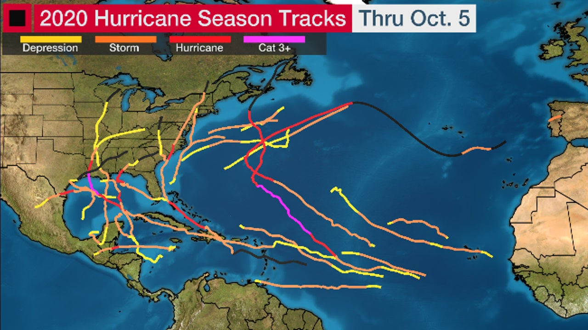

## LEAP Education 
#### Spring 2022
### Climate Predication Challenges 
### Project 1: Exploring Association bewteen Hurricane Tracks and Climate Change
### --- A "*Data Story*" using Jupyter Notebook on Google Colab

Climate change has become one of the biggest threats to humanity. It becomes increasingly important for us to understand better [how climate change affects extreme weather such as hurricanes](https://www.gfdl.noaa.gov/global-warming-and-hurricanes/). It has been suggested that the changing climate may lead to warmer sea surface temperatures, sea level rises, and shifts of the areas affected by hurricanes, etc. Hurricanes, as both directly observed behaviors of the earth system and extreme weather that has substantial impacts on human lives and society, are, therefore, of great interest to climate scientists. 

The goal of this project is to look deeper into the patterns and characteristics of hurricane tracks from seasons that date back as far as 1850s and how they associate with climate forcing factors. Applying data mining, statistical analysis and visualization, students should derive interesting findings in this collection of hurricane tracks, search the climate research literature for potential hypotheses, identify other useful data sources, and write a "data story" that can be shared with a **general audience**. 

### Datasets

+ International Best Track Archive for Climate Stewardship [(IBTrACS)](https://www.ncdc.noaa.gov/ibtracs/) from NOAA National Centers for Environmental Information. 
+ The data will be downloaded by the starter codes provided. 

### Challenge 

In this project you will carry out an **exploratory data analysis (EDA)** of hurricane tracks and write a reproducible data analysis *notebook* on interesting findings (i.e., a *data story*).

You are tasked to explore the data, driven by the climate research literture and interests among your team mates, using tools from data mining, statistical analysis and visualization, etc, all available in `Python` and create `Python/Jupyter` Notebook in [Google Colab](https://www.youtube.com/watch?v=inN8seMm7UI). Your notebook should be in the form of a `data story`, with both codes and text that describe the motivation of your analysis, the steps of your finalized analysis and discussions on interesting trends and patterns identified in your analysis. Your notebook should be organized in a logical order and contain only the codes and discussions of your finalized analysis.   

### Project organization

The project starter codes can be opened by following the link in its [GitHub copy](https://github.com/leap-stc/LEAPCourse-Climate-Pred-Challenges/blob/main/Project-StarterCodes/Project1-EDAV/lib/Project1-Starter.ipynb), which is also linked in courseworks. 

All the codes in this *starter codes* notebook can be modified to implement your research ideas.

To start, everyone,

+ create in your google drive a folder for this course.

The team leader of each team should

+ create in the course folder a folder for project 1.
This folder can be used to share notes and codes.
+ share project 1 folder with all team members.
	+ Team members should all create a shortcut to this shared project folder in their own folder for LEAP CPC.
+ go to "File/Save A Copy in Drive/" (upper left) and save a copy for your team in the project 1 folder that was just created.

Final product of this project is a Google Colab notebook that the team produce together, which will be presented on Feburary 8th, 2022. 
 
#### Suggested workflow
This is a relatively shorter project of the semester. We have about three weeks of working time. In the starter codes, we provide you basic basic data processing steps to show you how to get started. 

1. [wk1] Week 1 is the **data processing and mining** week. Read data description, **project requirement**, browse literature, data and codes in the starter codes, and think about what to do and try out different tools you find related to this task.
2. [wk1] Try out ideas on a **subset** of the data set to get a sense of computational burden of this project. 
3. [wk2] Week 2 is the **research and development** week. Explore data for interesting trends and start develop the analysis of your data story. 
4. [wk3] Week 3 is the **discussion and writing** week. Finalize your analysis for the notebook and write discussions on the results in relevance to hurricanes and climate change. 

#### Submission
You should produce a [Google Colab](https://colab.research.google.com/?utm_source=scs-index) notebook, where you should write a story on "How hurricanes are evolving in a changing climate" based on your data analysis. Your story, especially *main takeways* should be **supported by** your results and appropriate visualization. 

Your story should NOT be a laundry list of all analyses you have tried on the data or how you solved a technical issue in your analysis, no matter how fascinating that might be. 

### Useful resources

##### Useful Python pakcages
* [xarray](https://xarray.pydata.org/en/stable/), especially, notebook [examples](https://xarray.pydata.org/en/stable/gallery.html).
* [matplotlib](https://matplotlib.org/): visualization with Python
* [Pandas](https://pandas.pydata.org/): data analysis with Python
* [Charts in Colab](https://colab.research.google.com/notebooks/charts.ipynb)

##### Project tools
* A brief [guide](http://rogerdudler.github.io/git-guide/) to git.
* Putting your project on [GitHub](https://guides.github.com/introduction/getting-your-project-on-github/).
* [Markdown cheatsheet](https://www.markdownguide.org/cheat-sheet/)

##### Examples
+ [How you would visualize hurricane](https://www.storytellingwithdata.com/blog/2017/10/1/how-youd-visualize-hurricanes) by Storytelling with Data.
+ [Why Past Hurricane Seasons Don’t Tell Us Much About The Future](https://fivethirtyeight.com/features/why-past-hurricane-seasons-dont-tell-us-much-about-the-future/) by Five Thirty Eight
+ [Hurricane season ends historic as predicted by experts back in April](https://www.cnn.com/2020/11/30/weather/record-breaking-atlantic-hurricane-season-wrap-up/index.html) by CNN
+ [A good "data story"](https://drhagen.com/blog/the-missing-11th-of-the-month/)

##### Tutorials

For this project we will give **tutorials** and give comments on:

- Earth Systems
- Google Colab
- EDAV
