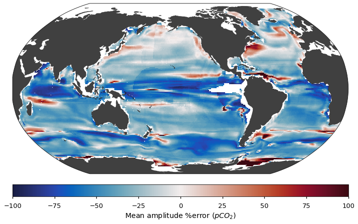

## LEAP Education 
#### Spring 2022
### Climate Predication Challenges 
### Project 3: Algorithmic developments for reconstructing air-sea CO$_2$ exchange



In this project, we will conduct research to further our understanding of machine learning algorithms' potential and limit for reconstructing air-sea CO2 exchange from sparse pCO2 observations. This is relatively open-ended project. Teams are invited to define their own research questions. 

#### Challenge

[Gloege et al (2021)](https://agupubs.onlinelibrary.wiley.com/doi/full/10.1029/2020GB006788)  carried out a systematic assessment of reconstruction skills of a state-of-the-art machine learning algorithm using 25 ensemble members each of four independent Earth system models.  [Gloege et al (2022)](https://agupubs.onlinelibrary.wiley.com/doi/full/10.1029/2021MS002620) proposed an eXtreme Gradient Boosting (XGBoost) algorithm to learn model-data mismatch and improve reconstruction. The starter codes provide the reproduction of such an evaluation using one Earth system model. In this project, you will propose research mini-projects to explore ideas that may lead to further improvements. 

#### Evaluation criteria 
+ Research idea
	+ Is the idea well-motivated by exploratory data analysis and/or existing literature?
	+ Is the idea well-explained and structured as a machine learning problem?
+ Methodology
	+ Is the methodology appropriate for the research problem?
	+ Is the implementation of the proposed methodology well explained and reproducible?
+ Results and Interpretation
	+ Do the results illustrate the value of the proposed methods towards the proposed research problem?
	+ Do the results provide scientific insights?
+ Presentation and organization
	+ Is the presentation convincing about the proposed methodology and its results?
	+ Are the methodology and results presented with appropriate visualization?
	+ Is the notebook organized and prepared in a way that makes it easier for readers to understand the proposed research, its method, implementation, results, and conclusion?

*(More details will be posted as grading rubrics in courseworks/canvas)*

#### Project details

##### Project time table.
+ Week 1 (March 22, 2022) Project release; presentation of the *science*. 
+ Week 2 (March 29, 2022) A deep dive into the starter codes; Machine learning tutorials. 
+ Week 3 (April 5, 2022) Q+A on starter codes; Research idea discussion.
+ Week 4 (April 12, 2022) Tutorials on explainable AI
+ Week 5 (April 19, 2022) LEAP research presentations; Q&A
+ Week 6 (April 26, 2022) Final presentations

##### Submission and Final presentation
Team should submit the link to the project's Google drive folder as submission. 

+ This will be a **research** presentation that statrs with "why", i.e., the research motivation and research questions. 
+ The novelty of research methodology, if any, should be explicitly discussed. 
+ The results should demonstrate both the value added due to the novel methods and their scientific relevance. 
+ The presentation may also include discussion on potential limitations of the research and future research directions. 

##### Platform requirement

The instructional team will evaluate your report using Google Colab with a [pro subscription](https://colab.research.google.com/signup). The pro subscription costs ~$10/month. The starter codes run without a pro subscription. Teams are encouraged to evaluate their own computational needs, and may consider or not the pro subscription as an option to consider more ambitious modeling choices. We will reimburse the cost of the pro subscription. 

##### Suggested team workflow
1. [wk1] Week 1 is the **learning** week. Read the papers, the starter codes, the data description, fully understand the **project requirement**, and discuss as team to understand the scientific problem. 
2. [wk1-wk2] As a team, study the starter codes, discuss how to collaborate using Google colab, and discuss potential research ideas. 
3. [wk2+3] Weeks 2&3 are the **exploration** week. Based on the in-class tutorials, start develop project ideas (start early on this one!) It is ok to have 2-3 leads to explore at the beginning of week 2 but it is better to converge on a single direction by the end of week 3. Feel free to read the literature to get inspiration.
4. [wk 3+5] Weeks 4&5 are the **research** weeks. By the beginning of week 4, you should have a clear plan on what research methodology to consider, what numerical experiments to run and how to summarize results. 
5. [wk 5] Week 5 is the **writing** week. You will consolidate results, clean up your notebook, and prepare your final presentation. You may need to create summaries and visualization to clearly illustrate your findings, which is likely to take some time. (Start early!)

##### Working together
- Team lead sets up a Google Drive project folder and share with teammates. Everyone saves the folder as a shortcut in their drive under a common path name. 

The folder could be organized with subfolders.

```
├──doc/
├──ESM/
├──figs/
├──lib/
├─────/main.ipynb
├──models/
├──README.md
```
- The `doc` folder should have documentations for this project, presentation files and other supporting materials. 
- The `ESM` folder contains data from the ESMs
- The `figs` folder contains figure files produced during the project and running of the codes. 
- The `lib` folder contain codes for the project. It may  have multiple files to contain subroutines. 
- The `models` folder contain ML model outputs,  reconstruction and performance metrics.

#### Useful Recourses

+ Chapter on *Tree-Based Methods* [An Introduction to Statistical Learning, 2nd Ed., by James, Witten, Hastie and Tibshirani](https://hastie.su.domains/ISLR2/ISLRv2_website.pdf).
+ Gloege, L., McKinley, G. A., Landschützer, P., Fay, A. R., Frölicher, T. L., Fyfe, J. C., ... & Takano, Y. (2021). Quantifying errors in observationally based estimates of ocean carbon sink variability. Global Biogeochemical Cycles, 35(4), [e2020GB006788](https://agupubs.onlinelibrary.wiley.com/doi/abs/10.1029/2020GB006788).
+ Gloege, L., Yan, M., Zheng, T., & McKinley, G. A. (2022). Improved quantification of ocean carbon uptake by using machine learning to merge global models and pCO2 data. Journal of Advances in Modeling Earth Systems, 14(2), [e2021MS002620](https://agupubs.onlinelibrary.wiley.com/doi/abs/10.1029/2021MS002620).
+ Stamell, J., R.R. Rustagi, L. Gloege, and G.A. McKinley (2020) Strengths and weaknesses of three Machine Learning methods for pCO2 interpolation, Geoscientific Model Development Discussions  [doi:10.5194/gmd-2020-311](https://doi.org/10.5194/gmd-2020-311) 
+ Large Ensemble Testbed [GitHub repo](https://github.com/lgloege/large_ensemble_testbed) maintained by [Luke Gloege[(https://github.com/lgloege)
